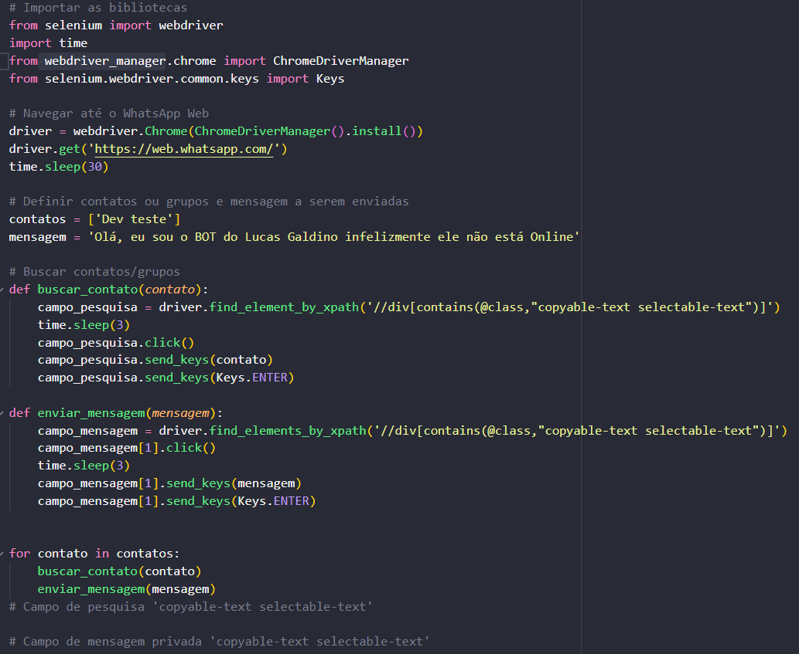

<h1>Bot para WhatsApp🤖</h1>

Nesse projeto eu desenvolvi um bot para o whatsapp, ele é um bot que manda uma mensagem já programada para um grupo específico do WhatsApp. Projeto totalmente densenvolvido em python.

<h2 align="center">
Ferramenta utilizada para desenvolver o projeto :toolbox:
</h2>
Este projeto foi desenvolvido com o Visual Studio Code 
April 2021 (version 1.56)
<a href="https://code.visualstudio.com/download">Download</a>  

<h1>Funcionalidades da aplicação :hammer_and_wrench:</h1>

- Envia mensagens definidas no código para qaulquer grupo   

<h2> Abaixo você consegue estar visualizando a imagem do código :pushpin:</h2>

